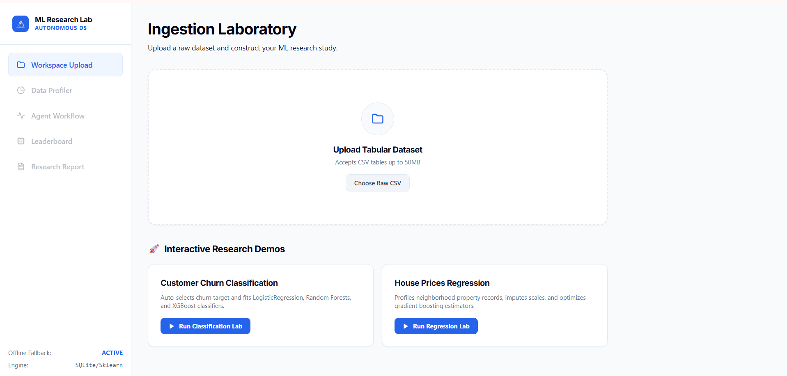
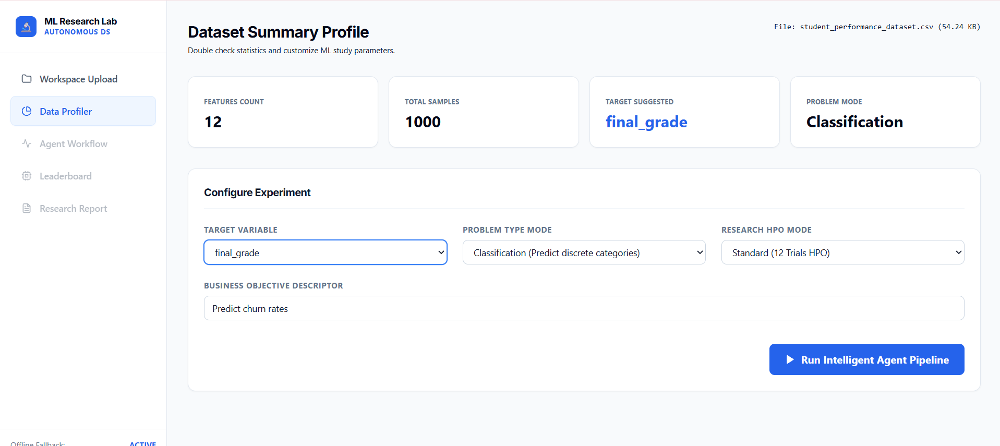
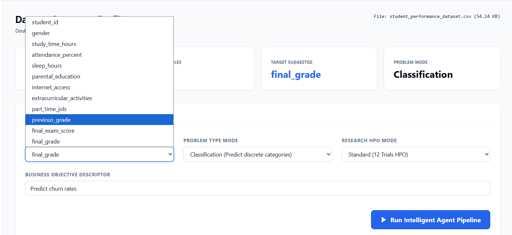
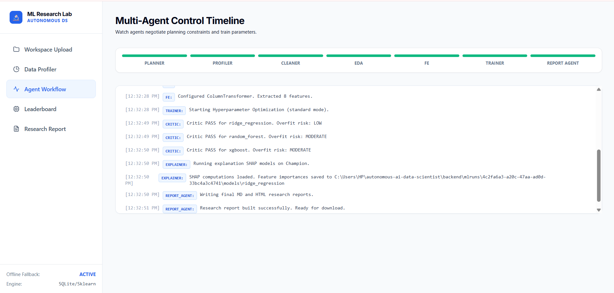
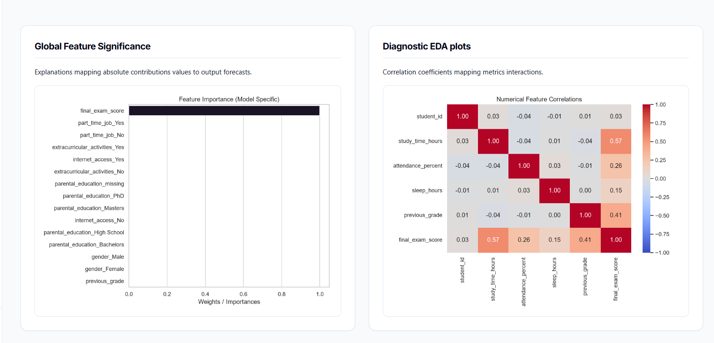
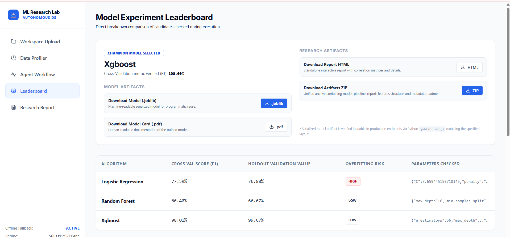
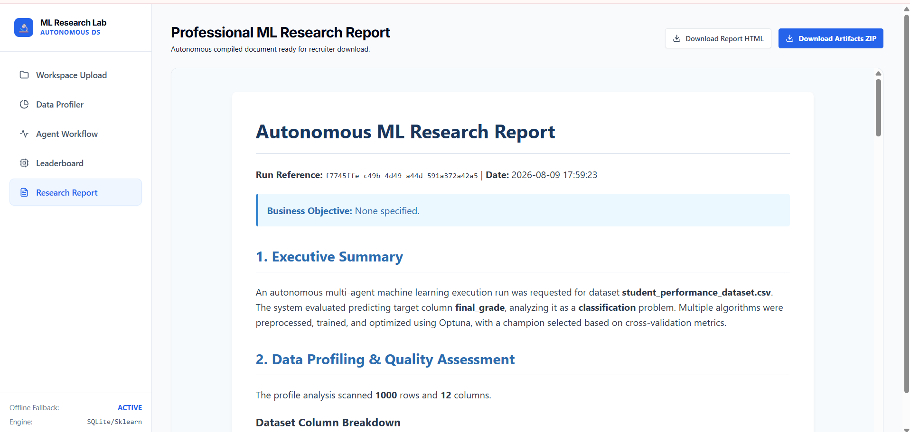
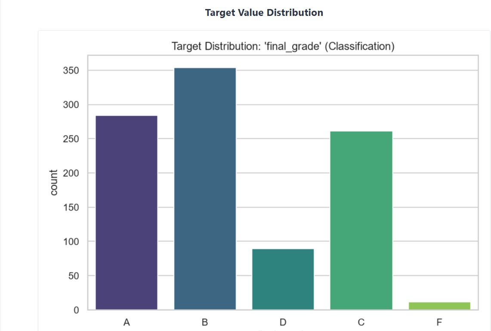
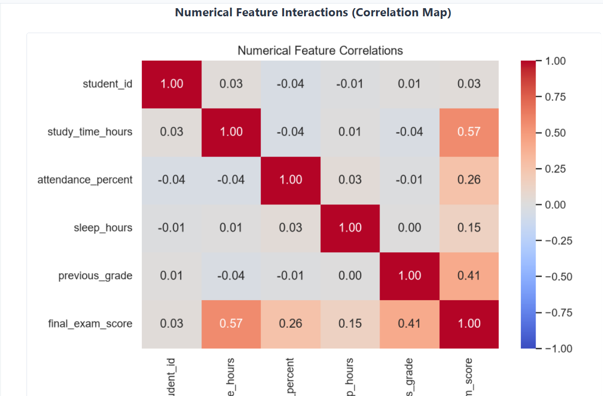
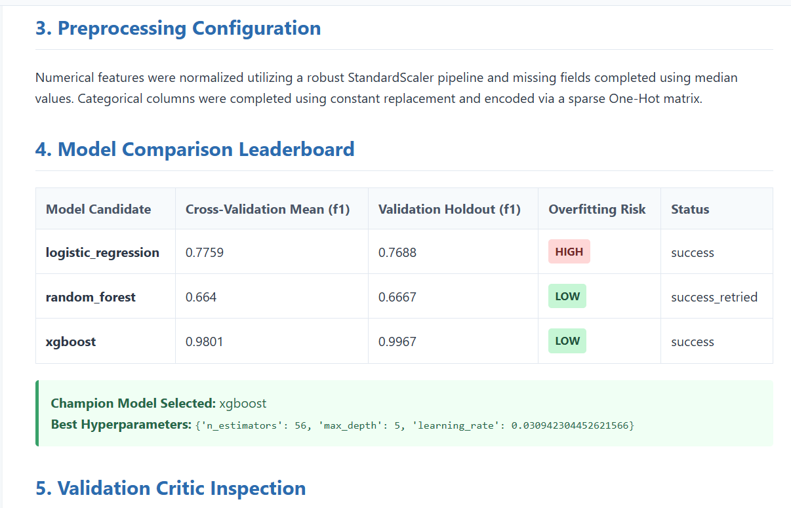

# Autonomous AI Data Scientist — ML Research Lab

> An agentic end-to-end machine learning research platform that automates dataset profiling, preprocessing, EDA, model training, hyperparameter optimization, validation, explainability, model criticism, and research artifact generation.

## Overview

Traditional machine learning workflows require significant manual effort across:

- Dataset inspection
- Data quality analysis
- Exploratory data analysis
- Feature preprocessing
- Model selection
- Hyperparameter tuning
- Validation
- Explainability
- Experiment reporting
- Model artifact management

**Autonomous AI Data Scientist — ML Research Lab** automates this workflow through an agentic ML research pipeline.

A user uploads a tabular CSV dataset, selects the target variable, and starts an experiment. The platform then orchestrates dataset profiling, preprocessing, EDA, model training, hyperparameter optimization, validation, quality checking, explainability, and research artifact generation.

The system is built as a full-stack application using **FastAPI** for the backend and **React/Vite** for the frontend.

---

## Key Features

### Dataset Intelligence

- Upload arbitrary tabular CSV datasets
- Automatic dataset profiling
- Dynamic column metadata extraction
- Numerical and categorical feature detection
- Missing-value analysis
- Identifier-like column detection
- Outlier analysis
- Dynamic target-variable selection

### Machine Learning

- Classification workflows
- Regression workflows
- Numerical feature preprocessing
- Categorical feature preprocessing
- Missing-value handling
- Mixed-type dataset support
- Multiple model candidates
- Cross-validation
- Holdout evaluation
- Champion model selection

### Hyperparameter Optimization

- Optuna-based hyperparameter search
- Model comparison
- Cross-validation based optimization
- Experiment-level tracking

### Agentic Workflow

The platform orchestrates multiple stages of the ML research workflow:

- Planning / orchestration
- Dataset profiling
- Data preprocessing
- Exploratory data analysis
- Feature engineering
- Model training
- Hyperparameter optimization
- Model evaluation
- Quality criticism
- Retry handling
- Explainability
- Research report generation

### Explainability

- Global feature importance
- SHAP-based analysis where available
- Feature significance visualization
- Explainability artifacts

### Research Artifacts

Completed experiments can generate:

- Serialized ML model
- Preprocessing pipeline
- Model Card PDF
- Research Report HTML
- Metrics JSON
- Experiment metadata
- EDA visualizations
- Explainability artifacts
- Consolidated ZIP package

---

## System Architecture

```text
                         ┌──────────────────────┐
                         │       User / UI      │
                         │      React/Vite      │
                         └──────────┬───────────┘
                                    │
                                    │ REST API
                                    ▼
                         ┌──────────────────────┐
                         │       FastAPI        │
                         │       Backend        │
                         └──────────┬───────────┘
                                    │
                                    ▼
                       ┌─────────────────────────┐
                       │   Agent Orchestrator    │
                       └────────────┬────────────┘
                                    │
                ┌───────────────────┼───────────────────┐
                ▼                   ▼                   ▼
        ┌──────────────┐    ┌──────────────┐    ┌──────────────┐
        │   Profiling  │    │ Preprocessing│    │     EDA      │
        └──────┬───────┘    └──────┬───────┘    └──────┬───────┘
               │                   │                   │
               └───────────────────┼───────────────────┘
                                   ▼
                         ┌──────────────────────┐
                         │   Model Training     │
                         │                      │
                         │ Logistic Regression  │
                         │ Ridge Regression     │
                         │ Random Forest        │
                         │ XGBoost              │
                         └──────────┬───────────┘
                                    │
                                    ▼
                         ┌──────────────────────┐
                         │     Optuna HPO       │
                         └──────────┬───────────┘
                                    │
                                    ▼
                         ┌──────────────────────┐
                         │ Validation / Metrics │
                         └──────────┬───────────┘
                                    │
                                    ▼
                         ┌──────────────────────┐
                         │   Quality Critic     │
                         │   + Retry Workflow   │
                         └──────────┬───────────┘
                                    │
                                    ▼
                         ┌──────────────────────┐
                         │   Champion Model    │
                         └──────────┬───────────┘
                                    │
                    ┌───────────────┼────────────────┐
                    ▼               ▼                ▼
              ┌──────────┐   ┌────────────┐   ┌──────────────┐
              │   SHAP   │   │ Model Card │   │ Research     │
              │ Analysis │   │    PDF     │   │ Report HTML  │
              └──────────┘   └────────────┘   └──────┬───────┘
                                                     │
                                                     ▼
                                            ┌──────────────────┐
                                            │  Artifact ZIP    │
                                            └──────────────────┘
End-to-End ML Workflow


CSV Upload
    ↓
Dataset Profiling
    ↓
Column Metadata
    ↓
User Selects Target
    ↓
X / y Separation
    ↓
Data Preprocessing
    ├── Numerical Features
    │      └── Imputation / Transformation
    │
    └── Categorical Features
           └── Imputation / Encoding
    ↓
EDA
    ↓
Candidate Model Training
    ↓
Cross Validation
    ↓
Optuna Hyperparameter Optimization
    ↓
Holdout Evaluation
    ↓
Quality Critic
    ├── PASS
    └── RETRY
    ↓
Champion Model
    ↓
SHAP / Feature Importance
    ↓
Research Report
    ↓
Model Card + Model + Artifact ZIP

ML Pipeline
Target Selection

The target variable is selected dynamically from the uploaded dataset.

The system does not depend on hardcoded target names such as Churn or Price.

The user's selected target is authoritative throughout the experiment.

The target is separated from the feature matrix before model training to prevent target leakage.

X = feature matrix
y = selected target

The selected target must never remain inside X.

Robust Preprocessing

The platform supports datasets containing:

Numerical columns
Categorical string columns
Missing values
Mixed categorical representations
Numerical and categorical columns together

Categorical features are encoded before being passed to ML estimators.

This allows the pipeline to handle mixed-type datasets without passing raw categorical strings into models that require numeric input.

Supported Models
Classification

Current classification models include:

Logistic Regression
Random Forest
XGBoost

Classification metrics can include:

Accuracy
Precision
Recall
F1
ROC-AUC
PR-AUC

depending on the experiment.

Regression

Current regression models include:

Ridge Regression
Random Forest Regressor
XGBoost Regressor

Regression metrics include:

MAE
MSE
RMSE
R²

Metrics are calculated from actual model predictions.

Unavailable metrics are not silently converted into zero values.

Hyperparameter Optimization

The platform integrates Optuna for automated hyperparameter optimization.

The workflow can:

Define model search spaces
Run candidate trials
Evaluate candidates using validation
Compare model configurations
Select optimized configurations
Continue the experiment using the strongest candidates
Quality Critic and Retry Workflow

The platform includes a quality-control stage after model evaluation.

The critic evaluates the current experiment results and can trigger a retry when the current result does not satisfy the configured quality criteria.

Model Training
      ↓
Evaluation
      ↓
Quality Critic
      │
      ├── PASS
      │    ↓
      │ Champion Model
      │
      └── RETRY
           ↓
      Improved Training
Explainability

The platform generates explainability outputs for supported models.

These can include:

Global feature importance
SHAP analysis
Feature significance visualizations

This allows the system to answer both:

Which model performed best?

and:

Which features contributed most to the model?

Research Report

The platform generates a human-readable HTML research report containing information such as:

Dataset characteristics
Data quality
Feature information
EDA results
Model candidates
Validation results
Champion model
Explainability
Experiment information
Model Card

The platform generates a human-readable Model Card PDF using ReportLab.

The Model Card can contain:

Experiment Information
Dataset
Experiment ID
Selected target
Problem type
Business objective
Dataset Summary
Number of rows
Number of columns
Numerical features
Categorical features
Missing values
Identifier-like columns
Model Information
Champion model
Algorithm
Hyperparameters
Features used
Preprocessing information
Validation

Classification:

Accuracy
Precision
Recall
F1
ROC-AUC
PR-AUC

Regression:

MAE
MSE
RMSE
R²
Explainability
Feature importance
SHAP information where available
Reproducibility
Experiment information
HPO information
Seed/timestamp where available
Model Artifacts

The platform separates machine-readable and human-readable outputs.

Machine-readable Model
best_model.joblib

Load it programmatically:

import joblib

model = joblib.load("models/best_model.joblib")
Human-readable Documents
model_card.pdf
research_report.html

The .joblib file is a serialized machine-learning artifact and is not intended to be opened as a document.

Artifact ZIP

The platform packages experiment outputs into a validated ZIP archive.

Typical structure:

autonomous_ai_data_scientist_run_<id>/
│
├── report/
│   ├── research_report.html
│   └── model_card.pdf
│
├── models/
│   ├── best_model.joblib
│   └── preprocessing_pipeline.joblib
│
├── metrics/
│   └── metrics.json
│
├── experiments/
│   └── experiment_metadata.json
│
├── explainability/
│   ├── feature_importance.png
│   └── SHAP artifacts
│
├── eda/
│   ├── correlation_heatmap.png
│   ├── target_distribution.png
│   └── other EDA artifacts
│
└── README.txt

The generated archive is validated using Python's ZIP integrity checking before being returned to the user.

REST API

The backend is implemented using FastAPI.

Interactive API documentation:

http://127.0.0.1:8000/docs

The API supports functionality for:

Dataset upload
Dataset profiling
Analysis execution
Experiment status
Experiment results
Research reports
Model artifacts
Model Card generation
HTML report download
Artifact ZIP download
Technology Stack
Layer	Technology
Languages	Python, TypeScript
Backend	FastAPI
Frontend	React, Vite
ML	Scikit-learn
Gradient Boosting	XGBoost
HPO	Optuna
Explainability	SHAP
Data Processing	Pandas, NumPy
Visualization	Matplotlib
Database	SQLite / PostgreSQL
PDF Generation	ReportLab
Testing	Pytest
Containerization	Docker
CI	GitHub Actions
Project Structure
autonomous-ai-data-scientist/
│
├── .github/
│   └── workflows/
│       └── ci.yml
│
├── backend/
│   ├── app/
│   │   ├── agents/
│   │   │   ├── orchestrator.py
│   │   │   ├── quality_critic.py
│   │   │   └── report_generator.py
│   │   │
│   │   ├── api/
│   │   │   └── routes.py
│   │   │
│   │   ├── core/
│   │   │   ├── config.py
│   │   │   └── llm.py
│   │   │
│   │   ├── data_science/
│   │   │   ├── preprocessor.py
│   │   │   ├── trainer.py
│   │   │   └── explainer.py
│   │   │
│   │   ├── database/
│   │   │   ├── connection.py
│   │   │   └── models.py
│   │   │
│   │   ├── schemas/
│   │   │
│   │   ├── tools/
│   │   │   ├── data_tools.py
│   │   │   ├── pdf_generator.py
│   │   │   └── viz_tools.py
│   │   │
│   │   └── main.py
│   │
│   ├── datasets/
│   ├── tests/
│   ├── Dockerfile
│   └── requirements.txt
│
├── frontend/
│   ├── src/
│   │   ├── App.tsx
│   │   ├── main.tsx
│   │   ├── index.css
│   │   └── services/
│   │       └── api.ts
│   ├── package.json
│   ├── Dockerfile
│   └── vite.config.ts
│
├── datasets/
├── scripts/
├── docker-compose.yml
├── .env.example
├── .gitignore
└── README.md
Installation
Prerequisites
Python 3.11+
Node.js
npm
Git

Docker is also supported through the project configuration.

Clone
git clone https://github.com/navyasrikota2006/autonomous-ai-data-scientist.git
cd autonomous-ai-data-scientist
Backend Setup
cd backend

Create a virtual environment.

Windows
python -m venv .venv
.venv\Scripts\activate
macOS / Linux
python3 -m venv .venv
source .venv/bin/activate

Install dependencies:

pip install -r requirements.txt
Environment Variables

Create a local .env file when API-based functionality requires it.

Use .env.example as the template.

Example:

GEMINI_API_KEY=your_api_key_here

Never commit your real API key.

The .env file is excluded through .gitignore.

Start Backend

From the backend directory:

python -m uvicorn app.main:app --host 127.0.0.1 --port 8000

Backend:

http://127.0.0.1:8000

Swagger:

http://127.0.0.1:8000/docs
Frontend Setup

Open a second terminal:

cd frontend
npm install
npm run dev

Open the local URL displayed by Vite.

Typical Usage
1. Start FastAPI backend
        ↓
2. Start React/Vite frontend
        ↓
3. Upload CSV
        ↓
4. Review dataset profile
        ↓
5. Select target variable
        ↓
6. Select/confirm problem type
        ↓
7. Run ML research pipeline
        ↓
8. Review EDA
        ↓
9. Compare candidate models
        ↓
10. Review champion model
        ↓
11. Inspect feature importance / SHAP
        ↓
12. Download Model Card PDF
        ↓
13. Download Research Report HTML
        ↓
14. Download Model
        ↓
15. Download complete Artifact ZIP
Testing

The backend contains automated tests covering the hardened ML pipeline.

Run:

cd backend
pytest -q

The current hardened version was verified with:

14 passed
0 failed

Verification covered areas including:

Target metadata
Target selection
Target leakage prevention
Mixed-type regression preprocessing
Holdout metrics
Model serialization
Model download
Model Card generation
HTML report generation
Artifact ZIP creation
ZIP integrity

The frontend production build was also verified successfully.

Data Leakage Protection

The selected target is explicitly separated from the feature matrix:

X = features
y = selected target

The target leakage tests verify that the user-selected target is not included in the training features.

This is implemented dynamically rather than relying on hardcoded column names.

Security

The project includes defensive measures such as:

Environment variables for API credentials
.env excluded from Git
Uploaded filename sanitization
Relative paths inside generated ZIP files
Protection against exposing local filesystem paths
No secrets intentionally included in generated artifacts
Target leakage checks
Download artifact validation
Example Datasets

The repository contains example datasets for demonstrating the ML workflow.

Classification
backend/datasets/churn_sample.csv
Regression
backend/datasets/housing_sample.csv

An additional student-performance dataset is included for demonstrating dynamic profiling and target selection.

Example Experiment

Example workflow:

Dataset
student_performance_dataset.csv
        ↓
Target
final_grade
        ↓
Problem Type
Classification
        ↓
Dataset Profiling
        ↓
Preprocessing
        ↓
EDA
        ↓
Model Training
        ↓
Logistic Regression
Random Forest
XGBoost
        ↓
Optuna HPO
        ↓
Validation
        ↓
Champion Model
        ↓
Feature Importance / SHAP
        ↓
Research Report
Model Card
Model Artifact
Artifact ZIP
Engineering Principles
Reproducibility

Experiments generate traceable artifacts rather than only transient UI results.

Separation of Concerns

Frontend, API, orchestration, ML processing, database access, and artifact generation are separated into dedicated components.

Real Metrics

Metrics are calculated from actual predictions.

User-Controlled Target

Automatic target suggestions do not override the target explicitly selected by the user.

Explainability

Model results are accompanied by feature-level analysis where supported.

Artifact Traceability

Generated artifacts are associated with their experiment/run context.

Defensive Engineering

Preprocessing, target handling, downloads, and generated artifacts are validated.

Limitations

The current platform focuses primarily on tabular machine learning workflows.

Performance depends on:

Dataset size
Dataset quality
Feature types
Target distribution
Available compute resources
Model complexity
Hyperparameter search size
Configured AI/LLM services

Large datasets or expensive HPO configurations may require additional infrastructure.

Automatic ML decisions should be reviewed by a human before being used in high-stakes production environments.

Future Improvements

Potential future extensions include:

Distributed experiment execution
Advanced experiment tracking
Model registry
Dataset versioning
Model drift detection
Automated retraining
Cloud deployment
Distributed hyperparameter optimization
Additional model families
Production monitoring
Authentication and role-based access
Dataset lineage
Scheduled experiments

These are future directions and are not represented as current functionality unless implemented.

Why This Project?

The goal is not simply to train a machine-learning model.

The goal is to engineer an end-to-end ML research workflow connecting:

Data
 ↓
Analysis
 ↓
Experimentation
 ↓
Optimization
 ↓
Validation
 ↓
Quality Control
 ↓
Explainability
 ↓
Documentation
 ↓
Reusable Artifacts

This project combines:

Agentic AI
AutoML
Machine Learning
Data Science
Explainable AI
Backend Engineering
Frontend Engineering
MLOps-oriented practices

into a single end-to-end platform.
---

## Product Screenshots

### Dashboard



### Dataset Profiling



### Dynamic Target Selection



### Multi-Agent ML Pipeline



### EDA & Explainability



### Model Leaderboard



### Research Report










Author
Navya Kota
B.Tech — Computer Science and Engineering

Interests:

Artificial Intelligence
Machine Learning
Data Science
Agentic AI
Full-Stack Engineering
MLOps
Cloud Technologies
Project Status

Working research/engineering prototype

The current implementation has been tested across the core ML, preprocessing, reporting, artifact generation, and frontend/backend integration workflows.