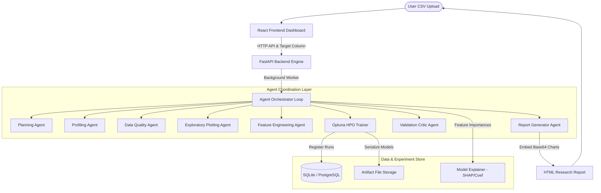
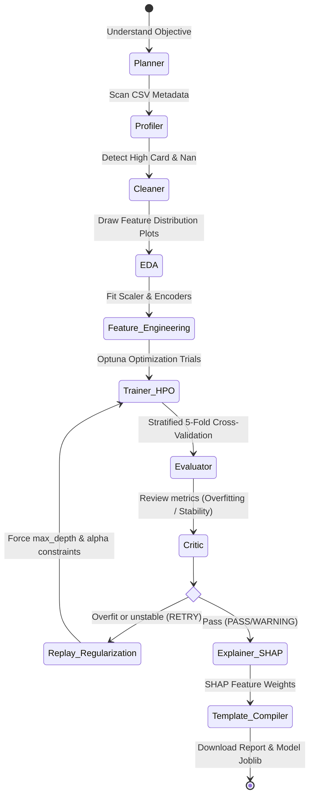

# AUTONOMOUS AI DATA SCIENTIST — ML RESEARCH LAB

> An autonomous multi-agent platform that transforms raw datasets into validated machine-learning experiments, explainable models, visual insights, and a reproducible research report.

---

## 🔬 Core System Architecture



## 🔄 Autonomous Planning & Replan Loop

The control workflow implements a full **Observe -> Evaluate -> Critique -> Adjust -> Replan** loop, preventing the system from blindly outputting the first training run.



---

## 🛠️ Technology Stack

- **Backend**: Python 3.11, FastAPI, SQLAlchemy, SQLite (Development), PostgreSQL (Production/Docker), Pydantic v2, Uvicorn, Jinja2 template engine.
- **Agent Orchestration**: custom State-transition execution log streams (with LangGraph structured design ideas).
- **Data Science**: Scikit-Learn (pipelines), Pandas, NumPy, XGBoost, Optuna (hyperparameter tuning), SHAP (local shapley values explanations).
- **Visualization**: Headless Matplotlib + Seaborn bindings for HTML report compilation.
- **Frontend**: React 18, Vite, Tailwind CSS, Lucide icons, TypeScript.
- **Deployment**: Docker, Docker Compose, Nginx.

---

## 🚀 Setup & Execution

### Option 1: Docker Compose (Quickest Production Setup)
Initialize the database, backend services, and front web panel in a single command. Runs Postgres on `5432`, Fast API on `8000`, and React Nginx on `80`.

1. Clone the repository and navigate inside:
   ```bash
   cd autonomous-ai-data-scientist
   ```
2. Copy env configs:
   ```bash
   cp .env.example .env
   ```
3. Boot Docker containers:
   ```bash
   docker compose up --build
   ```
4. Access the Dashboard at: `http://localhost/`

---

### Option 2: Live Local Development Run
Ensure you have **Python 3.11** and **Node 20+** installed on your system.

#### 1. Backend Service Setup
1. Open a terminal and navigate to the backend folder:
   ```bash
   cd backend
   ```
2. Install pip dependencies:
   ```bash
   pip install -r requirements.txt
   ```
3. Generate the public datasets and boot the dev server:
   ```bash
   python ../scripts/generate_sample_data.py
   python -m uvicorn app.main:app --reload --port 8000
   ```

#### 2. Frontend Panel Setup
1. Open a new terminal and navigate to the frontend folder:
   ```bash
   cd frontend
   ```
2. Install package nodes:
   ```bash
   npm install
   ```
3. Boot the Vite hot-reloading dev server:
   ```bash
   npm run dev
   ```
4. Access the React local client at: `http://localhost:3000/`

---

## 🔬 Auto-Validation & Overfitting Critique Guardrails

The critic reviews each candidate after HPO:
* **Overfitting Detector:** If `Train metric - Val metric > 0.15` (classification) or `r2_gap > 0.20` (regression), status flags to `RETRY`. The orchestrator locks regularization constraints (e.g. restricts max tree depth to 4, raises regularization penalty Alpha to 10.0) and triggers a hyperparameter rerun.
* **Target Leakage Guard:** If metrics hit a perfect `1.0000`, warning flags raise. This informs users that features likely contain identifiers (target leaks) and should be inspected.
* **Offline Fallback:** If LLM configuration is missing in `.env`, the system runs completely offline using a rule-based engine and templates, ensuring no crashes during local operations.
